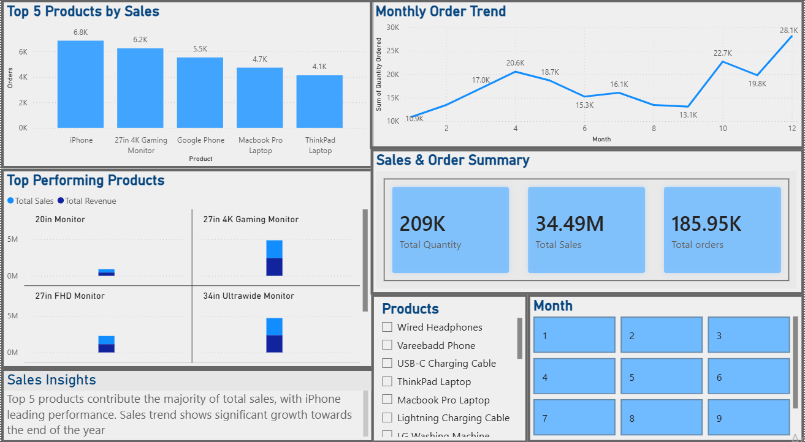

# Power BI Sales Dashboard
This project presents an interactive sales dashboard built using Power BI to analyze product performance and sales trends.
# Key Features
-Top 5 products by sales
- Monthly order trend analysis
- KPI cards for total sales, quantity, and orders
- Interactive filters (Product & Month)
# Tools Used
- Power BI
- Excel
# Insights
- Top 5 products contribute majority of total sales
- iPhone leads in performance
- Sales show strong growth towards the end of the year
# Dashboard Preview:

